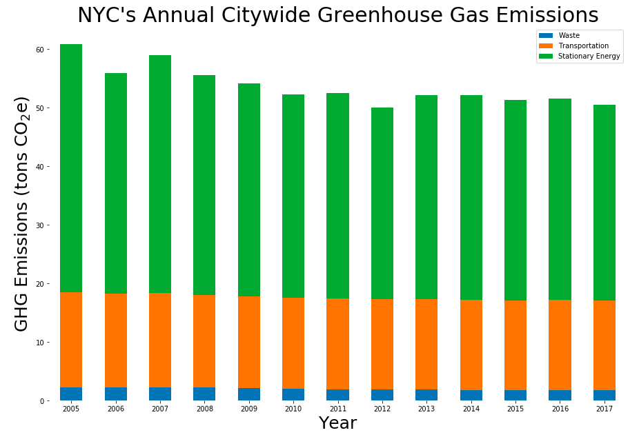

Since 2005, GHG emissions have decreased in NYC citywide
by approximately 15% despite significant increases in
population and economic activity. Citywide GHG emissions have
been reduced slightly since 2016 due to a decrease in carbon
intensity of the electricity grid serving NYC.