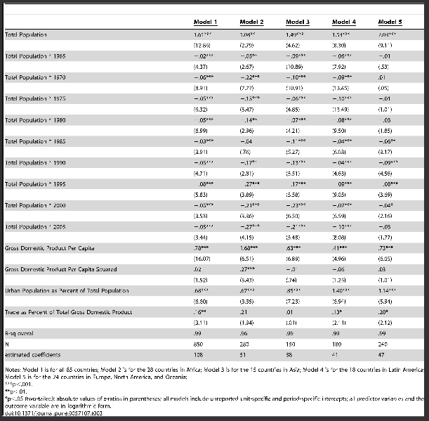

{
 "cells": [
  {
   "cell_type": "markdown",
   "metadata": {},
   "source": [
    "| **Statistical Analyses**\t|  **IV(s)**  |  **IV type(s)** |  **DV(s)**  |  **DV type(s)**  |  **Control Var** | **Control Var type**  | **Question to be answered** | **_H0_** | **alpha** | **link to paper**| \n",
    "|:----------:|:----------|:------------|:-------------|:-------------|:------------|:------------- |:------------------|:----:|:-------:|:-------|\n",
    "|Multiple Regression| 14, Population, Population 1965, Population 1970, Population 1975, Population 1980, Population 1985, Population 1990, Population 1995, Population 2000, Population 2005, GDP per capita, GDP per capita squared, Urban Population as Percent of Total Population, Trade as Percent of Total Gross Domestic Product| ratio | 1, Total Carbon Dioxide Emissions| ratio| 4, GDP per capita, GDP per capita squared, Urban Population as Percent of Total Population, Trade as Percent of Total Gross Domestic Product| ratio| What is the Relationship between National-Level Carbon Dioxide Emissions and Population Size| Model fitting rather than null hypothesis testing | see Table 3 for beta coefficients and R squared in each of the 5 models | [The Relationship between National-Level Carbon Dioxide Emissions and Population Size: An Assessment of Regional and Temporal Variation, 1960–2005](https://journals.plos.org/plosone/article?id=10.1371/journal.pone.0057107) |\n",
    "  |||||||||"
   ]
  },
  {
   "cell_type": "markdown",
   "metadata": {},
   "source": [
    ""
   ]
  }
 ],
 "metadata": {
  "kernelspec": {
   "display_name": "PUI2016_Python3",
   "language": "python",
   "name": "pui2016_python3"
  },
  "language_info": {
   "codemirror_mode": {
    "name": "ipython",
    "version": 3
   },
   "file_extension": ".py",
   "mimetype": "text/x-python",
   "name": "python",
   "nbconvert_exporter": "python",
   "pygments_lexer": "ipython3",
   "version": "3.5.4"
  }
 },
 "nbformat": 4,
 "nbformat_minor": 2
}
