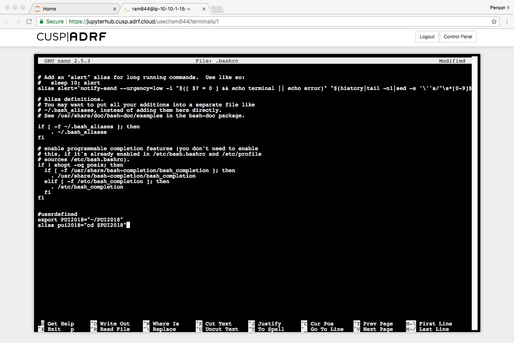

# PUI2018_ram844
This is a repository for PUI Homework #2

Steps taken to set up my environment in HW1:

1. Created a directory on my ADRF workspace using mkdir command
2. created an environmental variable PUI2018 that points to that directory 
3. used echo $PUI2018
4. used export VARNAME="<var end point>" to set up environmental variable
5. used nano to edit the .bashrc file
6. created an alias using "alias pui2018="cd $PUI2018"
7.had the terminal read the new version of the file as I modified it and store the new env variable and alias using source ~/.bashrc
8. Typed 
pwd
pui2018
pwd

